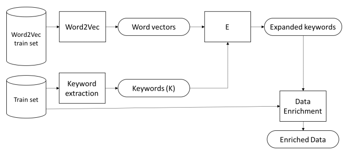

# Document Ranking With Word Embeddigns 

Traditional document ranking methods can only retrieve documents which contains only the query words (Ex: Smart and intelligence is compeletely different words. you cannot find documents containing intellgence when you search for smart). However, a document could be relevant to a query without any common words. In this method word embeddings, keyword extraction and TFIDF documet ranking are combined in order to avoid such cases. The method contains two steps. in the first step, teh documents and query are enriched which is described by the figure below. In the next step the cosine similarity is computed between TFIDF vectors of enriched query and document pairs and top N similar documents are retrieved. 

You can read more about enrichment procedure in chapter 3.3 of the following document. [Topic Modeling and Clustering for Analysis of Road Traffic Accidents](https://publications.lib.chalmers.se/records/fulltext/250497/250497.pdf) 
### Dependencies
Python 2.7.12
[gensim](https://radimrehurek.com/gensim/)
[scikit learn](http://scikit-learn.org/stable/index.html)

